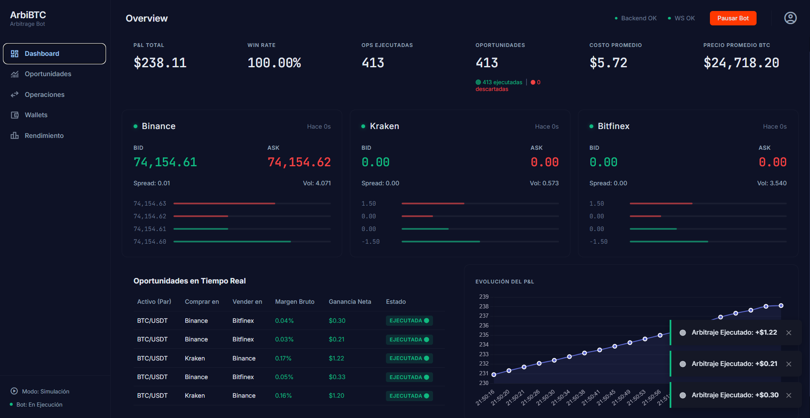
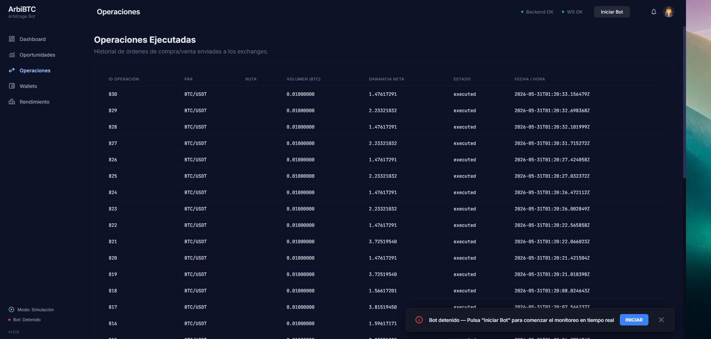
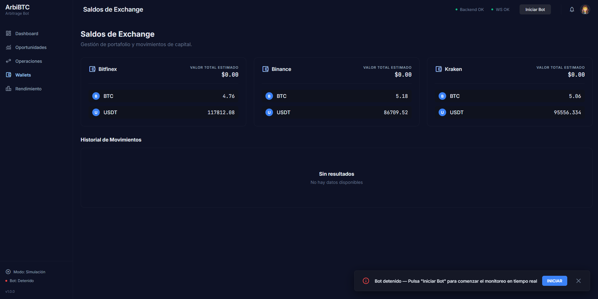
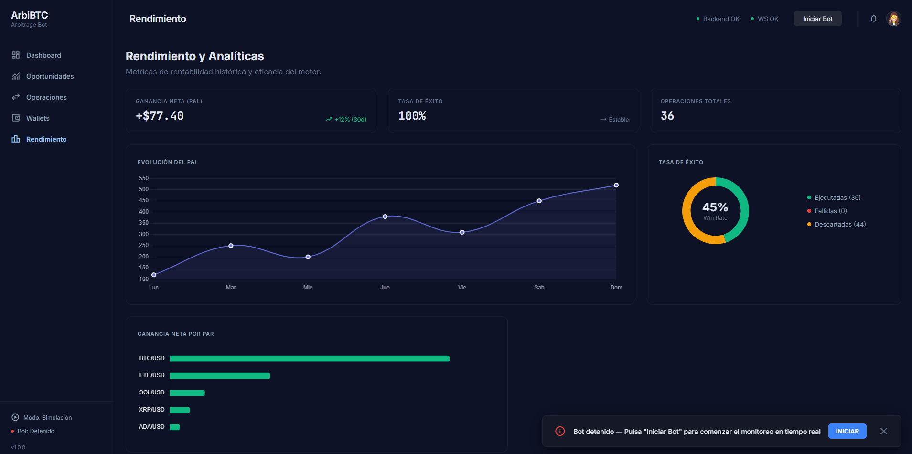

# 📈 ArbiBTC - Sistema de Arbitraje en Tiempo Real

 *(Nota: Colocar captura de pantalla del Dashboard aquí)*

ArbiBTC es un sistema automatizado de trading algorítmico diseñado para detectar, evaluar y ejecutar simulaciones de arbitraje de Bitcoin (BTC/USDT) en tiempo real a través de múltiples plataformas de intercambio (Binance, Kraken y Bitfinex).

Este proyecto fue desarrollado como solución al **Hackathon Challenge**, cumpliendo estrictamente con los requisitos de evaluación mediante una arquitectura asíncrona, robusta y escalable.

---

## 🚀 Características Principales (Requisitos del Challenge)

1. **📡 Monitoreo en Tiempo Real (WebSockets):** Conexión directa a los feeds públicos de Binance, Kraken y Bitfinex mediante WebSockets (cero *polling*) para mantener un Order Book consolidado con la menor latencia posible.
2. **🧠 Motor de Detección de Arbitraje:** Algoritmo de cruce continuo que identifica divergencias de precios (Ask < Bid) entre exchanges en cuestión de milisegundos.
3. **💸 Cálculo de Costos Reales:** El motor no se engaña con márgenes brutos. Cada operación deduce automáticamente comisiones (*Trading Fees* variables por exchange), costos de retiro (*Withdrawal Fees*), y márgenes de seguridad por *Slippage*.
4. **⚖️ Restricciones de Liquidez:** El sistema nunca opera por encima de la liquidez real. Ajusta el volumen dinámicamente basándose en la profundidad real del Order Book (`bid_volume` y `ask_volume`).
5. **🪪 Gestión de Wallets:** Tras cada operación simulada, el balance local de USDT y BTC de las billeteras virtuales se descuenta e incrementa con total integridad transaccional.
6. **📊 Dashboard de Grado Institucional:** Interfaz web premium con KPIs dinámicos, historial detallado de operaciones, monitoreo de PnL y visualización de oportunidades descartadas vs ejecutadas en tiempo real.

---

## 🛠️ Stack Tecnológico

### Backend
- **Framework:** Python 3.11 + Django 5 + Django REST Framework (DRF)
- **Asincronismo:** ASGI (Daphne), Django Channels (WebSockets)
- **Caché y Colas:** Redis
- **Base de Datos:** PostgreSQL (Neon Tech)
- **Arquitectura:** Patrón Event-Driven para ruteo de oportunidades a la UI.

### Frontend
- **Framework:** Vue 3 (Composition API) + Vite
- **Lenguaje:** TypeScript
- **Estilos:** CSS3 Nativo (Variables CSS, Flexbox/Grid, Tematización Oscura Premium)
- **Estado Global:** Pinia
- **Comunicación:** Axios (REST) + WebSockets API nativa.

### Infraestructura / DevOps
- **Frontend:** AWS Amplify
- **Backend:** Amazon EC2 (Ubuntu, Gunicorn/Daphne, Nginx)
- **Base de Datos:** Serverless Postgres via Neon
- **Control de Versiones:** Git / GitHub

---

## 📸 Capturas de Pantalla

| Dashboard Principal | Historial de Operaciones |
|:---:|:---:|
|  <br> *Monitoreo en tiempo real de Bid/Ask* |  <br> *Tabla con ganancia neta y liquidez ajustada* |

| Gestión de Wallets | Análisis de Rendimiento |
|:---:|:---:|
|  <br> *Actualización de balances post-operación* |  <br> *Gráficas de PnL (Profit and Loss)* |

*(Asegúrate de agregar tus imágenes a la carpeta `/screenshots/` de tu repositorio).*

---

## ⚙️ Instalación y Desarrollo Local

### Prerrequisitos
- Python 3.10+
- Node.js 18+
- Servidor Redis corriendo localmente (Puerto 6379) o URL de Redis Cloud.

### 1. Clonar el repositorio
```bash
git clone https://github.com/UzielTzab/coding-challenge-mexico-vue-drf.git
cd coding-challenge-mexico-vue-drf
```

### 2. Configuración del Backend (Django)
```bash
cd backend
python -m venv venv
source venv/bin/activate  # En Windows: venv\Scripts\activate
pip install -r requirements.txt

# Configurar variables de entorno basándose en la plantilla
cp .env.example .env

# Ejecutar migraciones
python manage.py migrate

# Cargar datos semilla (Exchanges y Fees)
python manage.py loaddata apps/exchanges/fixtures/initial_exchanges.json

# Iniciar servidor ASGI
daphne -p 8000 config.asgi:application
# o en desarrollo clásico: python manage.py runserver
```

### 3. Configuración del Frontend (Vue 3)
```bash
# Abrir una nueva terminal
cd frontend
npm install

# Configurar variables de entorno locales (si es necesario)
cp .env.example .env

# Iniciar servidor de desarrollo (Vite)
npm run dev
```

El frontend estará disponible en `http://localhost:5173/` y se comunicará automáticamente con el backend en el puerto 8000.